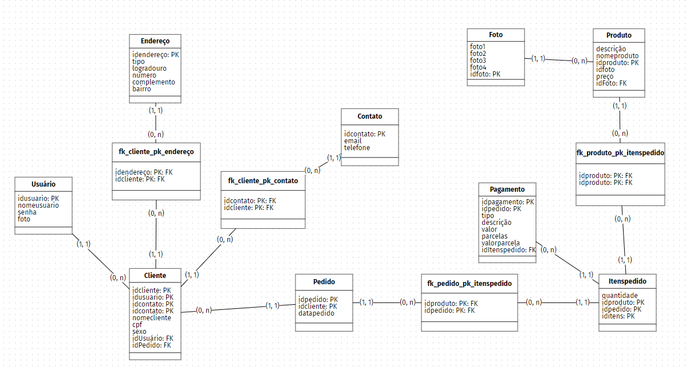
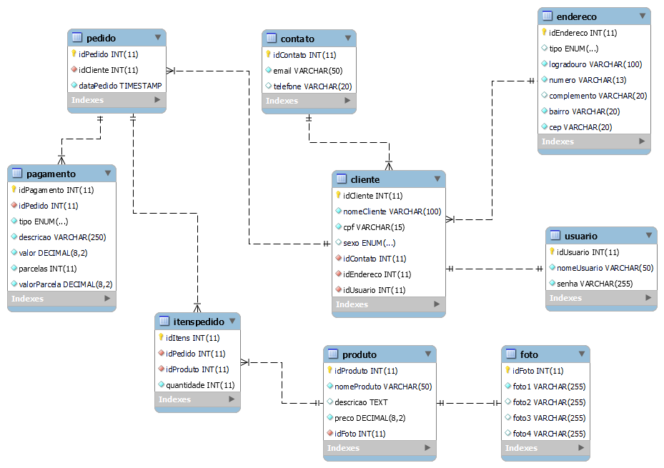

# _Documentação da criação de um banco de dados MySQL_
### Nesta documentação você irá encontrar todo o passo a passo feito para a criação do banco de dados de uma loja fictícia. Desde o modelo conceitual até o modelo físico.
### Vale lembrar que neste projeto não foram utilizados softwares pagos, todos os softwares utilizados estão disponíveis gratuitamente na internet.

--------

## _Ferramentas utilizadas:_
### Para a construção do projeto, foram utilizadas as seguintes ferramentas:
###  • [draw.io](https://app.diagrams.net/) que é a ferramenta de diagramação que foi utilizada para a construção da parte conceitual. Neste projeto também foi utilizado o  [BRModeloWeb](https://www.brmodeloweb.com/lang/pt-br/index.html) para a contrução da parte lógica, mas a mesma poderia ter sido feita no [draw.io](https://app.diagrams.net/) sem problema algum.
### • [XAMPP](https://www.apachefriends.org/pt_br/index.html) foi utilizado para carregar e subir o banco de dados MySQL na porta 3306 (DEFAULT).
### • [MySQL Workbench](https://www.mysql.com/products/workbench/) que é uma ferramenta gráfica de modelagem de dados e administração de banco de dados MySQL.

--------


--------

## _Modelo Conceitual_
O modelo conceitual de banco de dados é uma representação abstrata dos dados que são utilizados pela empresa, permitindo a identificação e a organização dos dados e suas inter-relações.

O processo de criação do modelo conceitual de banco de dados envolve uma série de etapas, desde a definição dos requisitos de negócio até a identificação das entidades, relacionamentos e atributos que compõem o modelo. 

No banco de dados criado foi definido o seguinte cenário:

Uma plataforma de comércio eletrônico que visa armazenar informações referentes aos seus clientes, produtos, compras e pagamentos realizados. Tal empreendimento requer um eficiente gerenciamento de dados, de modo a garantir a integridade e a confiabilidade das informações armazenadas, bem como a proteção da privacidade e da segurança dos dados dos clientes. Por conseguinte, a implementação de um sistema de gestão de banco de dados é essencial para o bom funcionamento da loja virtual.

Com base nas necessidades do cliente, foram estabelecidas as seguintes tabelas:

    •  Usuário
    •  Endereço
    •  Contato
    •  Cliente
    •  Produtos
    •  Fotos
    •  Pedido
    •  Itens Pedidos
    •  Pagamento | Checkout

Tendo isso em mente utilizamos a ferramenta de diagramação ([draw.io](https://app.diagrams.net/)) para a construção deste modelo conceitual.


Posteriormente, é realizada a primeira normalização do banco de dados. A normalização é um processo de organização das tabelas visando a minimização da redundância de dados e inconsistências, seguindo um conjunto de regras e procedimentos preestabelecidos. O objetivo desse processo é reduzir o risco de erros e inconsistências nos dados armazenados no banco.

--------

## _Modelo Lógico_
Um modelo lógico é feito a partir da identificação de entidades, atributos e relacionamentos de um sistema. Ele serve para representar a estrutura do banco de dados de forma abstrata, independente de um SGBD específico. O modelo lógico facilita a comunicação entre os envolvidos no desenvolvimento do sistema, auxilia no planejamento de como os dados serão armazenados e organizados, e ajuda na detecção de inconsistências e erros na estrutura do banco de dados antes de sua implementação.

Se por acaso utilizar o [BRModeloWeb](https://www.brmodeloweb.com/lang/pt-br/index.html) para realizar a diagramação, ele automáticamente realizará a construção do modelo lógico, sendo necessária apenas a normalização do mesmo. Mas caso tenha utilizado o [draw.io](https://app.diagrams.net/),é necessário realizar este processo manualmente.



Foi também elaborado um esquema de banco de dados utilizando uma ferramenta de planilhas para facilitar a criação do modelo físico do banco de dados. Tal procedimento visa otimizar o processo de modelagem do banco de dados.


--------

## _Modelo Físico_
O modelo físico de um banco de dados é a representação concreta do esquema de banco de dados em termos de tabelas, colunas, chaves primárias e estrangeiras, relacionamentos e restrições de integridade. Esse modelo é implementado por meio de um conjunto de comandos de linguagem de definição de dados (DDL) que permitem a criação e modificação do banco de dados. 

Vale lembrar que o principal objetivo desta documentação não é demonstrar como funciona a linguagem. Aqui será demonstrado apenas comandos necessários para a criação do banco de dados. 

Sendo assim, vamos iniciar a criação do nosso banco de dados:
```
/* 
Como primeiro comando vamos dizer ao MySQL para criar um novo banco de dados com a seguinte sintaxe:
CREATE DATABASE nome_do_banco
*/
```
```
CREATE DATABASE kibaratu;
```
```
/*
Logo em seguida vamos informar ao MySQL que desejamos utilizar o banco de dados que acabamos de criar como seguinte comando:
USE nome_do_banco
*/
```
```
USE kibaratu;
```
```
/*
Agora já temos o nosso banco criado e também já estamos com ele selecionado, então agora podemos começar a criar nossas tabelas.
O comando para a criação das tabelas é CREATE TABLE nome_da_tabela;
Lembre-se vamos criar nossas tabelas e seus campos com base no que foi desenhado nas etapas anteriores.
Com isto vamos continuar nossa construção. 
*/
```
```
CREATE TABLE usuario(
    idUsuario int auto_increment primary key,
    nomeUsuario varchar(50) not null unique,
    senha varchar(255) not null
);
```
```
CREATE TABLE endereco(
    idEndereco int auto_increment primary key,
    tipo enum("Rua", "Avenida", "Travessa", "Alameda", "Viela"),
    logradouro varchar(100) not null,
    complemento varchar(20),
    bairro varchar(20) not null,
    cep varchar(20)
);
```
```
CREATE TABLE contato(
    idContato int auto_increment primary key,
    email varchar(50) not null unique,
    telefone varchar(20) not null
);
```
```
CREATE TABLE cliente(
    idCliente int auto_increment primary key,
    nomeCliente varchar(100) not null,
    cpf varchar(15) not null unique,
    sexo enum("Masculino", "Feminino", "Outros"),
    idContato int not null,
    idEndereco int not null,
    idUsuario int not null
);
```
```
CREATE TABLE produto(
    idProduto int auto_increment primary key,
    nomeProduto varchar(50) not null,
    descricao text not null,
    preco decimal(8.2) not null,
    idFoto int not null
);
```
```
CREATE TABLE foto(
    idFoto int auto_increment primary key,
    foto1 varchar(255) not null unique,
    foto2 varchar(255),
    foto3 varchar(255),
    foto4 varchar(255)
);
```
```
CREATE TABLE pedido(
    idPedido int auto_increment primary key,
    idCliente int not null,
    dataPedido timestamp default current_timestamp
);
```
```
CREATE TABLE itenspedido(
    idItens int auto_increment primary key,
    idPedido int not null,
    idProduto int not null,
    quantidade int not null
);
```
```
CREATE TABLE pagamento(
    idPagamento int auto_increment primary key,
    idPedido int not null,
    tipo enum("Crédito", "Débito", "Pix", "Boleto", "Transferência"),
    decricao varchar(250) not null,
    valor decimal(8.2) not null,
    parcelas int not null,
    valorParcela decimal(8.2) not null
);
```

-----



Esta imagem do modelo físico é gerada automaticamente pelo [MySQL Workbench](https://www.mysql.com/products/workbench/) após a criação do banco de dados pelo mesmo.

### Pronto! Agora nosso banco de dados está criado.

------

Novamente, esta documentação não tem o objetivo de mostrar o gerenciamneto de um banco de dados ou seu funcionamento. Esta documentação tem como principal objetivo apenas demonstrar as principais etapas da criação de um banco de dados MySQL, criando assim uma loja de comercio eletrônico fantasia chamada "KiBaratu".

Por Henrique Santos. Contato rickdev.contato@gmail.com
